# Testing
## Functional Testing
Testing of site features has been carried out, and the results documented below.
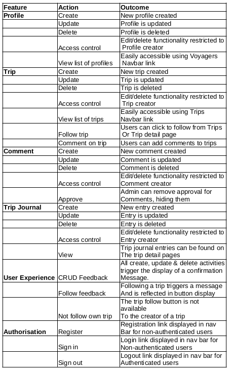

## Validator Testing

### HTML
All pages were run through the [HTML Validator](https://validator.w3.org/#validate_by_input). This had to be done using the direct input method due to the presence of Django template tags within the html files, by pasting in the HTML shown by right-clicking and selecting "inspect source".

After resolving some simple unclosed script tag errors and fixing the approach used to implement trip comment update and delete functionality, which had initially used a button 'type' attribute, almost all pages passed showing no errors. 

The only exceptions to these were within packages used to develop the website:
- Crispy-Forms: the Trip, Traveller and TripDay models' edit pages  failed due to this package adding a 'type' attribute to textareas displayed in the form for models.CharField fields.
- allauth: the signup page failed due to stray tags and unclosed elements within the signup form, contained within the package.

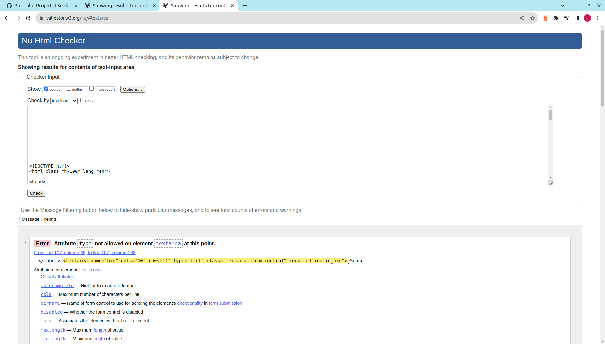

### CSS
The stylesheet created for this website was passed through the [CSS Validator](https://jigsaw.w3.org/css-validator/#validate_by_input), and no errors were found.

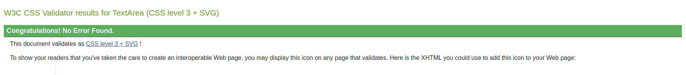

### Python
The Python code written for the models and views files within each app on this project was passed through a [Python Checker](https://www.pythonchecker.com/) to show any errors or non-conformance with the PEP 8 style guide. The views files were all 100% compliant, and models needed only the addition of spaces around operators.

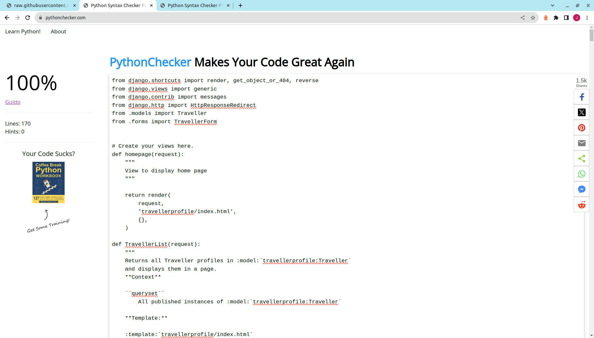

### JavaScript
The JavaScript files written for this website were passed through [jshint](https://jshint.com/) and found to contain no errors, with only advisory warnings about syntax available in ES6 being displayed. An example can be seen below.

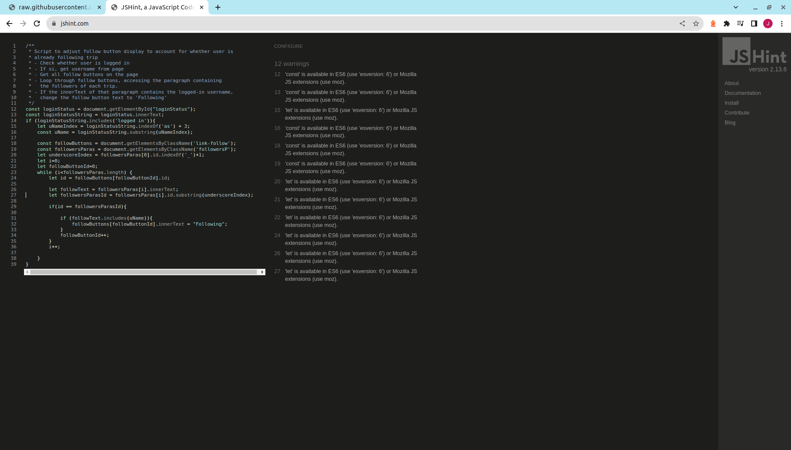

## Lighthouse

The Lighthouse report showed areas for improvement on SEO and Accessibility. As a result the secondary font color was changed to improve contrast and a meta tag was added to describe the site content. There was some range between the different pages on the site for the performance score due to image loading, however all came in as acceptable. The best and worst reports are shown below.

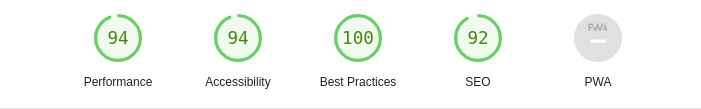

## Responsiveness

The responsiveness of all pages was tested to ensure that the website was accessible to users on a range of devices. This was carried out using the following steps:

- Navigate to [See My Trip](https://seemytripcapstone-0e4622862850.herokuapp.com/)
- Open developer tools (right click -> inspect)
- Set width adjustment pane to responsive and decrease width to smallest (less than 400px)
- Set zoom to 50%
- Drag window to full width and back.

The website should be responsive across all screen sizes, with no images exhibiting any pixelation or distortion. Elements should not overlap, and no horizontal scroll should be present.

The result of this testing was as expected, and can be seen in the GIFs below. The website was also examined in Firefox on a Samsung Galaxy S20+ and performed in line with expectations.

### Results
Home Screen:

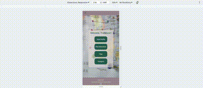

Trips:

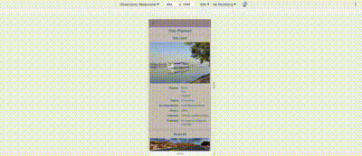

Voyagers:

Trip Page:

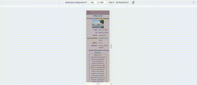

Profile Page:

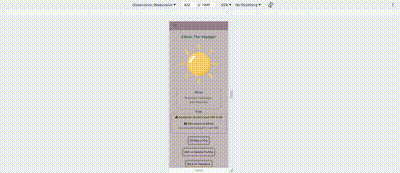

Journal Entry Page:

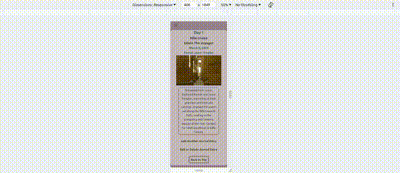

Trip Form:

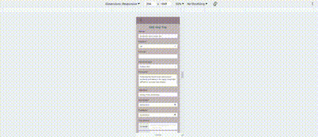

Profile Form:

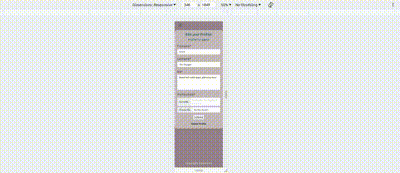

Journal Entry Form:

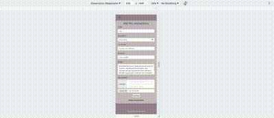

## Browser Compatibility
The website was tested on three different browsers as shown below, and displayed well in each. In Firefox the responsivity was affected slightly on the home screen, with some element overlap between approximately 600-1000px screen width. This is a bug that will be addressed at a later stage.

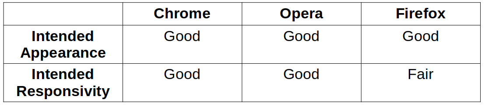